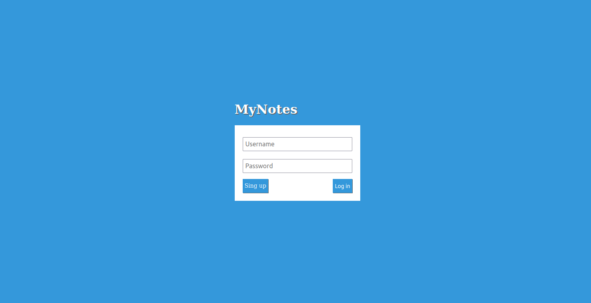
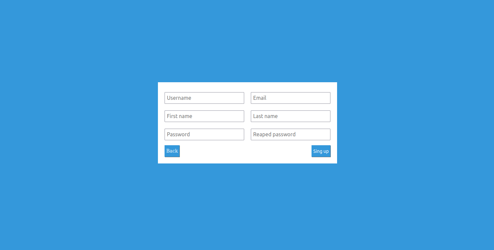
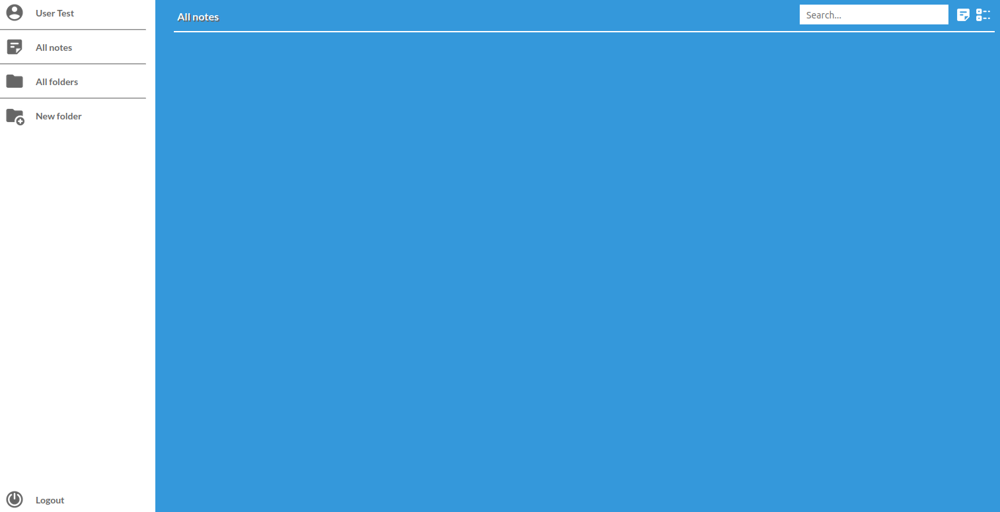
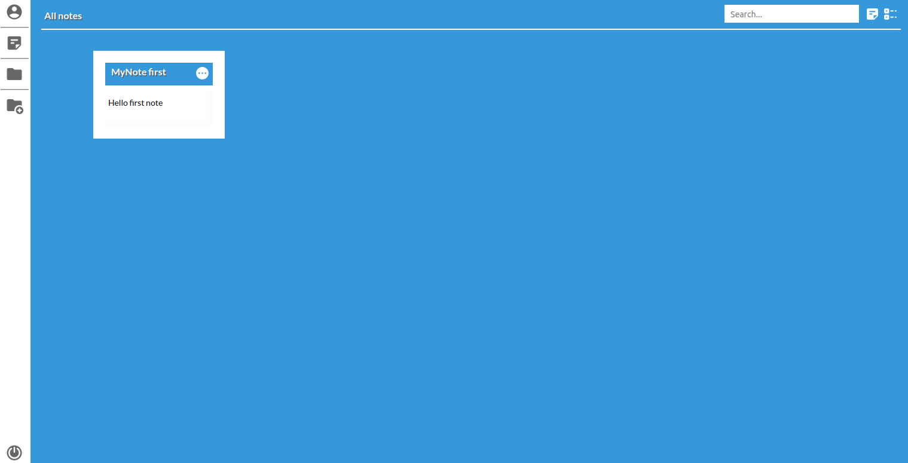
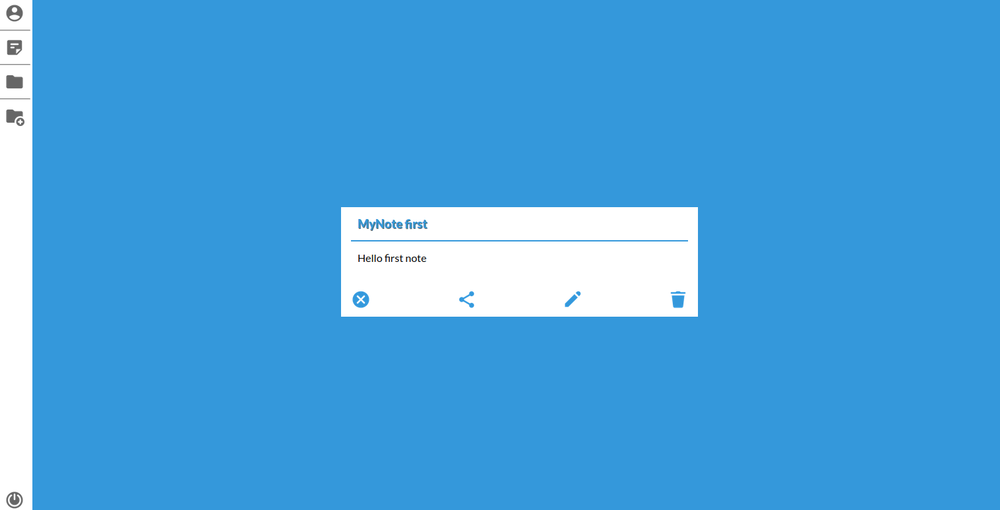

# MyNotes

Web application to creating text notes or checklist. Users can create a personal account, where they can create notes and save for itself.

Log in page.

When you open the application, you'll see a login page, but first you need to create an account (press button Sign up).

Sign up page.

After successful registration, you're redirected to the login page. (please entry username and password for login and press Log in). If you're successfully logged, you can begin to create your first note or list.

Home page.

At home page, we have sidebar and view of all our note, but first we need to create it. In top right, we have two buttons, one for create note, the other for list. 

Click create note  or create list 

When you create your note, you will see it at home page. For more details, click button: 

At the details page you can edit your note, send it to your friend if he has myNotes account too and also delete the note. By the way, when you create a folder for your notes, you can add note to folder at note edit page or when you create your note but if folder already created.

Creating folder very simple, you need only input name for your folder. All your folder you can check by click on All folder button at sidebar. At the sidebar will also be a scrolling area with folders.

That's all, enjoy myNotes, it's very simple to use. All basic knowledge you already read.